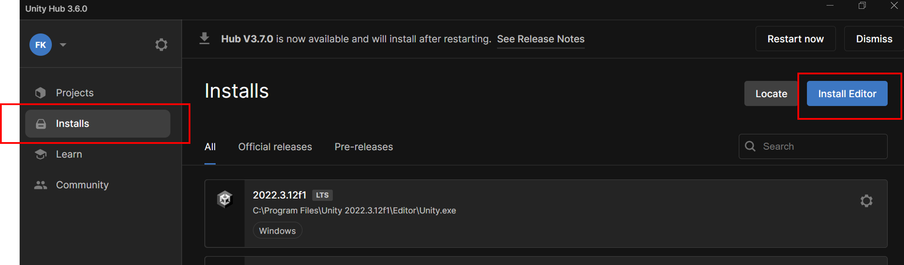

<h1>Combining Eye-Tracking and EEG Experiments with immersive Virtual Reality </h1> 
<h2>Challenges and Opportunities for Cognitive Neuroscientists — a workshop </h2>
 
 

**By:** Felix Klotzsche

<h2>Abstract</h2>

As virtual reality (VR) technology continues to evolve, it becomes more accessible for cognitive neuroscientists to use it as a tool in research. This advancement allows for the study of behaviors in more immersive settings that extend beyond the limitations of conventional screen-based experiments. In this interactive workshop, we will explore together the current state of VR technology from an experimenter’s perspective. A key part of our workshop will be dedicated to the integration of techniques such as EEG and eye tracking into VR-based experiments. We will illustrate an exemplary workflow of extending an experimental paradigm, originally designed for a traditional 2D screen, into an immersive VR experiment. The workshop will consist of a theoretical and a practical part. In the first section, we will conceptually navigate through various challenges encountered during this process and discuss the advantages and constraints set by common VR headsets. We will discuss the trade-off between maintaining experimental control and achieving naturalism, spatial reference frames, managing timing aspects, and explore methodologies to incorporate the fact that data was captured in VR into the analysis of EEG and eye tracking data. In the second part of the workshop, we encourage participants to join us in programming a simple demo experiment using the Unity game engine. This practical exercise will provide insights into how some of the theoretical concepts discussed earlier are applied in a real-world implementation.
Our goal is to offer a comprehensive, realistic overview of the process involved in establishing a VR-based experiment from the perspective of a cognitive neuroscientist, thereby enhancing understanding and intuition about whether VR integration represents a valuable option for specific research scenarios.

<h2>Instructions</h2>

> **Shortcuts**  
- [A PDF version of the slides for the theoretical part](./Slides/Workshop_VrForCognitiveScientists_Slidedeck_KlotzscheOhl.pdf).
- Scenes:
  - Full demo scene with all functionality implemented: [./Assets/Scenes/SceneFinal.unity](./Assets/Scenes/SceneFinal.unity)
  - Empty scene to rebuild the full scene yourself (only environment and infrastructure): [./Assets/Scenes/SceneEmpty.unit](./Assets/Scenes/SceneEmpty.unity)
- [The Unity layout file `layout.wlt` which I am using for the practical part](https://github.com/eioe/workshop_vrcogsci/blob/main/ProjectSettings/layout.wlt)  
- [LabStreaminglayer for Unity GitHub repository](https://github.com/labstreaminglayer/LSL4Unity)

   
> **Most important**  
If you run into problems, please do not hesitate to contact me (e.g., via email, see [slides](./Slides/Workshop_VrForCognitiveScientists_Slidedeck_KlotzscheOhl.pdf)) or open an issue here. So if you have questions or want to work with the code or the slides, I am happy to support you.
  
**How to get started for the practical part:**   
1. Install [Unity Hub](https://unity.com/unity-hub).
2. Create a Unity ID (Personal Plan): [https://id.unity.com/](https://id.unity.com/)
3. Within Unity Hub, install the latest “Official Release” (2022.3) of the Editor. 
   

   
Screenshot

    
   
   

4. Clone this repository to a clean local directory. 
5. In Unity Hub: click `Add` > select the repository folder.
6. The project should now show up in the `Projects`section in your unity Hub. Click on it to open it.
7. Now you should be ready to have fun. 😊 
8. "Play" the experiment (easy):  
    1. Open the full demo scene with all functionality implemented: [./Assets/Scenes/SceneFinal.unity](./Assets/Scenes/SceneFinal.unity).  
    2. Press the `Play` button in Unity (top center).  
    3. In the `Game` window within your Unity Editor, you now see the participant's view. You can turn the "head" using your mouse or touchpad. To move around you can use the `W`, `A`, `S`, `D` keys (move: forward, left, back, right), as well as `E` and `Q` (move: up and down).  
    4. To start the experiment, click `Submit` in the control window on the left. Then press `Start Experiment`, then `Proceed` (2 times until it is greyed out). You can now hide the control window by clicking on `Toggle eDIA` (bottom right corner in the `Game`window).  
    5. To start the first trial look at the fixation target displayed on the tablet on the work bench (i.e., align the gaze target in your field of view with the fixation target). Now do the Posner task by "lookng" as fast as possible at the target objects left and right. At the beginning of each trial you have to look back at the fixation target.
9. Rebuild the experiment (advanced):
    1. Open the empty scene to rebuild the full scene yourself (only environment and infrastructure): [./Assets/Scenes/SceneEmpty.unit](./Assets/Scenes/SceneEmpty.unity).
    2. Try to reconstruct the task by follow along while I am doing it or by peeking into the full scene every now and then.
   

<h2>Versions</h2>  

> You can use the `tags` in the repo to identify the according commits.

`2024-02`: Workshop at the **Dep. of Experimental Psychology, University of Oxford** – 19 Feb 2024 (Felix Klotzsche & Sven Ohl)
